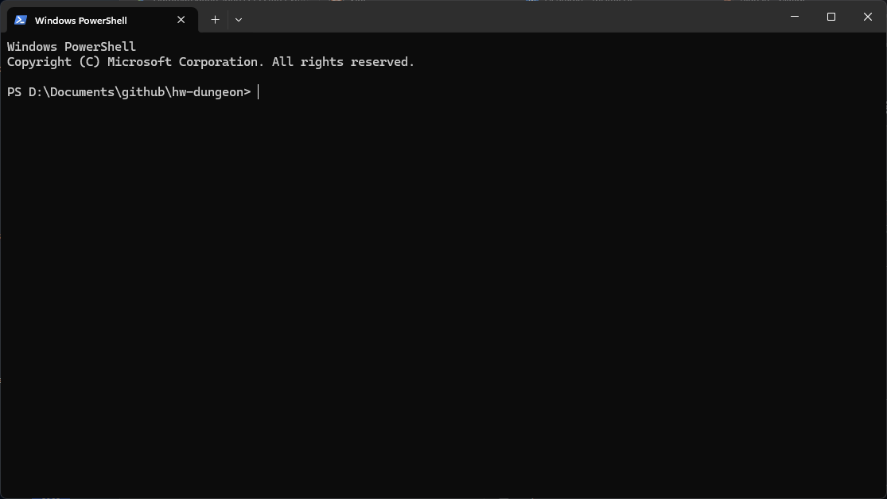
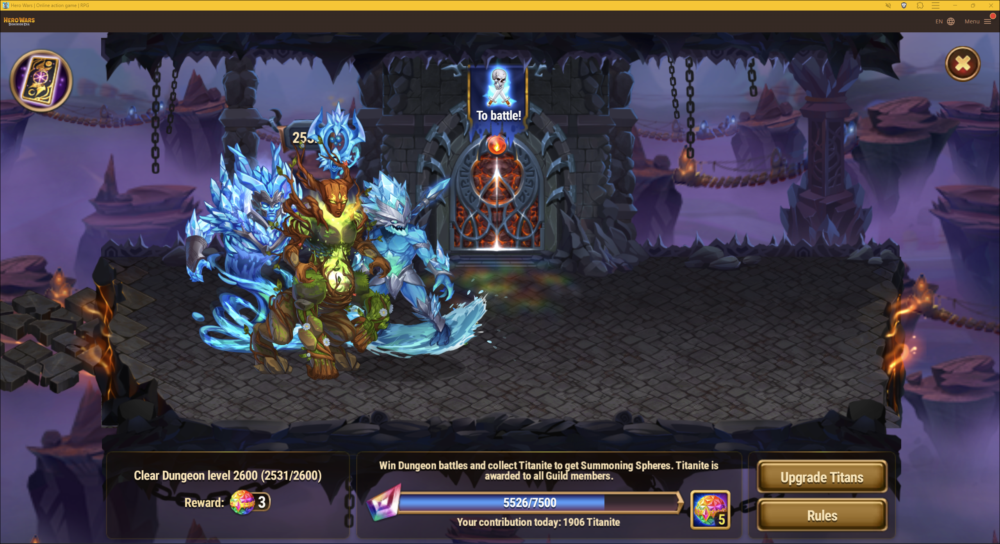

# hw-dungeon

This Python script Automates Dungeon battles in the game Hero Wars.

It runs on Windows 10 or 11.  
It relies on partial screenshot recognition from the "screenshots" folder to identify where to click on the screen.  
The provided screenshots account for the game's window size. They were taken from an English version of the game on a 2560 x 1440 (2K) resolution screen with the game window maximized:


If your setup is different, you will need to retake the screenshots and replace the files in the "screenshots" directory.

## Prerequisites

1. [Install Python](https://learn.microsoft.com/en-us/windows/dev-environment/python?tabs=winget) unless you already have Python installed on your machine. The script was developed using Python 3.13, but higher versions will work without issues.

2. Download this project from the GitHub repository:
- Click the "<> Code" button
- Select "Download ZIP"


3. Extract the ZIP file into a folder on your PC. This folder will be referred to as the "script directory" in the rest of this documentation. In my example, it is `D:\Documents\github\hw-dungeon`.

4. To verify that Python is correctly installed and working, right-click inside the script directory and select "Open in Terminal". A PowerShell window will open:



In this window, type `python --version`. Output similar to this should be displayed:
```shell
PS D:\Documents\github\hw-dungeon> python --version
Python 3.13.11
PS D:\Documents\github\hw-dungeon>
```

5. To isolate the script in a dedicated environment, create a venv. In the PowerShell window, run these commands one after another, waiting for each step to finish:
```
python -m venv venv
venv\Scripts\python -m pip install --upgrade pip
venv\Scripts\python -m pip install -r requirements.txt
```

These three commands execute the following steps:
- Create a virtual environment in the "venv" directory (fast)
- Upgrade the venv's "pip" module (fast)
- Install the Python modules required for the script (takes longer)

--> From this point on, if everything completed without errors, the script is ready to run.

## Running the script

The script is limited to the Hero Wars Dungeon. You must launch the game and navigate to the Dungeon:



Notes:
- You must unlock Divination Cards manually; the script will not do it for you. If Divination Cards are available, they will be used.
- Teams must be set up beforehand; make sure to rebuild teams that lost members on previous days.
- The game window must remain visible while the script is running.
- If the game is running in a browser tab, that tab must be active.
- Your PC will be unusable while the script runs because it controls the mouse to click inside the game window.
- To stop the script, minimize the game window so the script fails to locate the next button, or press CTRL+C in the PowerShell window (this will stop the script with a minor error).

Right-click inside the script directory and select "Open in Terminal". In the PowerShell window, type:
```shell
venv\Scripts\python hw-dungeon.py
```

The script will run until stopped via CTRL+C or until it fails to locate the next button within a specific timeframe.

## How it works

Feel free to inspect and modify the script code. If you make improvements, please submit a PR to the GitHub repository at [MrWaloo/hw-dungeon](https://github.com/MrWaloo/hw-dungeon).

Upon starting, the script looks for a window titled "Hero Wars | Online action game | RPG" and brings it to the foreground if found.

It then loops through the following sequence:

### Step 1

|   |   |   |
| -- | -- | -- |
| Click above the Dungeon door | screenshots/Door To battle.png |  |
| OR |   |   |
| Click to activate the Dungeon floor | screenshots/Button Activate.png |  |
| Wait and click the "Collect" button | screenshots/Button Collect.png |  |

### Step 2

|   |   |   |
| -- | -- | -- |
| Click an "Attack" button | screenshots/Button Attack.png |  |
| OR |   |   |
| Click the "Accept this fate!" button | screenshots/Button Accept this fate.png |  |

Notes:  
- If required to choose between two Titan teams, the script clicks randomly on one of the two buttons.
- If the "Accept this fate!" button was clicked, the script restarts the loop from the beginning.

### Step 3

|   |   |   |
| -- | -- | -- |
| Click the "To battle!" button | screenshots/Button To battle.png |  |
| OR |   |   |
| Click the "Accept this fate!" button | screenshots/Button Accept this fate.png |  |

Note:  
- If the "Accept this fate!" button was clicked, the script restarts the loop from the beginning.

### Step 4

|   |   |   |
| -- | -- | -- |
| Click the "To battle!" button | screenshots/Button To battle.png |  |

Note:
- The battle starts after loading.

### Step 5: Battle

|   |   |   |
| -- | -- | -- |
| Enable "Auto" mode | screenshots/Button Auto gray.png |  |
| Confirm "Auto" mode | screenshots/Button Auto green.png |  |
| Then... |   |   |
| Click the "OK" button | screenshots/Button OK.png |  |

Note:  
- The script restarts the loop from the beginning.

## Adjusting screenshots for your resolution

If the script fails to detect buttons, your screenshots do not match your current resolution or language settings. Replace the image files in the "screenshots" folder with new captures suited to your configuration.

Important: Always run the script with the exact same window size; maximizing the window is recommended for consistency.

